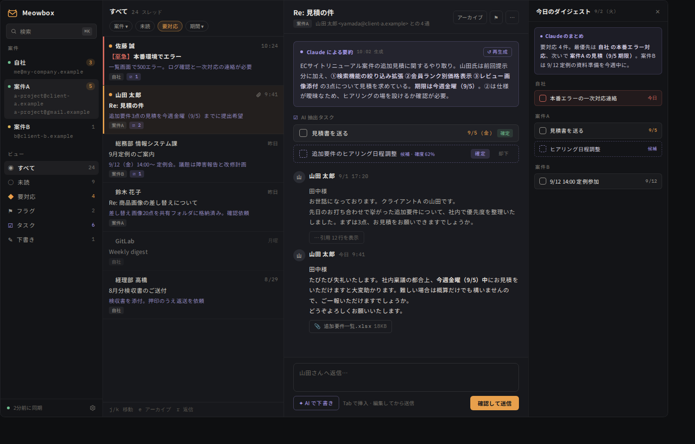
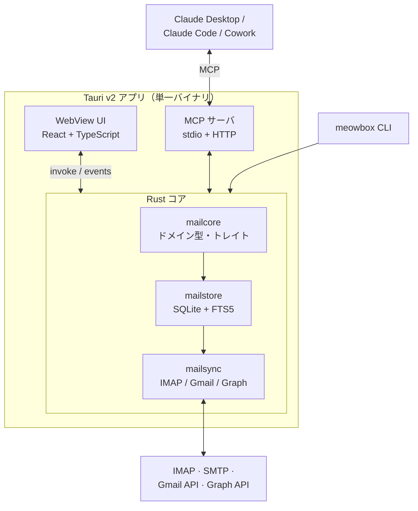

# Meowbox 🐱📮

**案件ごとに配られたメールアドレスを 1 つに束ね、Claude が中から直接さわれるメーラー。**
_An AI-friendly mail aggregator, written in Rust._

[](https://github.com/icethink/meowbox/actions/workflows/ci.yml)




## 特徴 / Features

- **案件でメールを束ねる** — 1 案件に複数アドレスが配られても、`project_tag` で
  横断して 1 つの受信箱として扱える（汎用 IMAP / Gmail / Microsoft 365）
- **MCP を内蔵** — Claude Desktop / Claude Code / Cowork から検索・要約・タスク抽出・
  下書き作成まで直接できる。他アプリ経由の不安定な連携を挟まない
- **誰が書いたか一目で分かる** — 人間由来は橙（`--accent`）、Claude 由来は藤（`--ai`）。
  要約・抽出タスク・AI 下書きは色と枠線の形で本文と区別する
  （[ADR 0004](docs/adr/0004-accent-and-ai-two-colour-rule.md)）
- **送信は必ず人間が押す** — MCP に送信ツールを出さない。AI は下書きまで
  （[ADR 0002](docs/adr/0002-no-send-over-mcp.md)）
- **日本語メールが前提** — ISO-2022-JP / Shift_JIS のデコードと、SQLite FTS5 の
  trigram トークナイザによる日本語全文検索。raw `.eml` もファイルに残すので、
  MCP が止まっていても Claude がファイルとして読める

## アーキテクチャ / Architecture



依存の向きは **core ← store ← sync ← (mcp, cli, desktop)**。逆流させない。
UI が落ちても CLI と MCP は動く。

## Quick start

必要なもの: Rust (stable, **MSVC ABI**) / Node.js 20+ / pnpm。
Windows では VS Build Tools (C++) と WebView2 ランタイムも要る。

```sh
# Rust 側（同期エンジン・ストア・MCP・CLI）
cargo build --workspace
cargo test --workspace

# デバッグ用 CLI
# DB と .eml の置き場は OS のアプリデータディレクトリ配下（Windows なら
# %APPDATA%\dev.icethink.meowbox\）。開発中は MEOWBOX_DATA_DIR で上書きできる
cargo run -p mailcli -- init
cargo run -p mailcli -- accounts add --name work --email you@example.com \
    --project 案件A --host imap.example.com --username you@example.com
# 暗黙 TLS（既定 993）の代わりに STARTTLS（143 など）を使う場合は --starttls を足す
cargo run -p mailcli -- accounts list

# パスワードは対話入力で OS の資格情報ストア（Windows なら資格情報マネージャー）に保存する。
# DB にも設定ファイルにも書かれない
cargo run -p mailcli -- accounts set-password 1

# 直近 90 日（既定）を同期。2 回目以降は前回からの UID 差分だけ取る
cargo run -p mailcli -- sync --account 1 --folder INBOX
cargo run -p mailcli -- sync --account 1 --folder INBOX --days 30

cargo run -p mailcli -- search "見積" --project 案件A
cargo run -p mailcli -- show 42

# デスクトップアプリ
cd apps/desktop
pnpm install
pnpm tauri dev
```

> **Windows での注意:** リポジトリのパスに非 ASCII 文字（日本語など）を含めないこと。
> pnpm と Tailwind のネイティブ部分がクラッシュする。

## リポジトリ構成 / Layout

```
crates/mailcore   ドメイン型・バックエンドトレイト（I/O なし）
crates/mailstore  SQLite ストレージ、スキーマ、FTS
crates/mailsync   IMAP / Gmail / Graph バックエンド、MIME パース、同期エンジン
crates/mailmcp    Claude 向け MCP サーバ
crates/mailcli    デバッグ用 CLI `meowbox`
apps/desktop      Tauri v2 アプリ（src-tauri + React フロント）
docs/design       UI デザインとデザイントークン
docs/adr          設計判断の記録
```

## ロードマップ / Roadmap

| フェーズ | 内容 | 状態 |
|---|---|---|
| P0-a | workspace 雛形、スキーマ、`meowbox init / accounts / search` | ✅ |
| P0-b | `mailsync` で IMAP 同期 → SQLite | 次 |
| P1 | `mailmcp`（`list_accounts` / `search_messages` / `get_thread` / `inbox_digest`） | |
| P2 | Tauri UI（一覧・スレッド・タスク・ダイジェスト） | ✅ |
| P3 | 要約・タスク抽出・下書き・承認送信を実データに繋ぐ | |
| P4 | Gmail / M365 OAuth、IMAP IDLE、過去分バックフィル | |
| P5 | 案件横断ダッシュボード、日次ダイジェスト、Thunderbird からのインポート | |

詳細は [docs/DESIGN.md](docs/DESIGN.md)。

## 開発 / Development

- 作業ルールと「次の一手」は [CLAUDE.md](CLAUDE.md)
- 設計判断は [docs/adr/](docs/adr/)
- UI のデザインとトークンは [docs/design/](docs/design/)。色は必ず
  `tokens.css` 経由で使う（HEX 直書きは eslint が落とす）
- CI は `cargo fmt --check` / `cargo clippy -D warnings` / `cargo test` を
  ubuntu と windows で、フロントは eslint / prettier / `tsc --noEmit` / vitest /
  `vite build` を回す

このリポジトリは Claude Code を使った AI 駆動開発で書かれている。
`claude` を起動して「CLAUDE.md の次のフェーズを進めて」で続きから始められる。

## License

MIT
