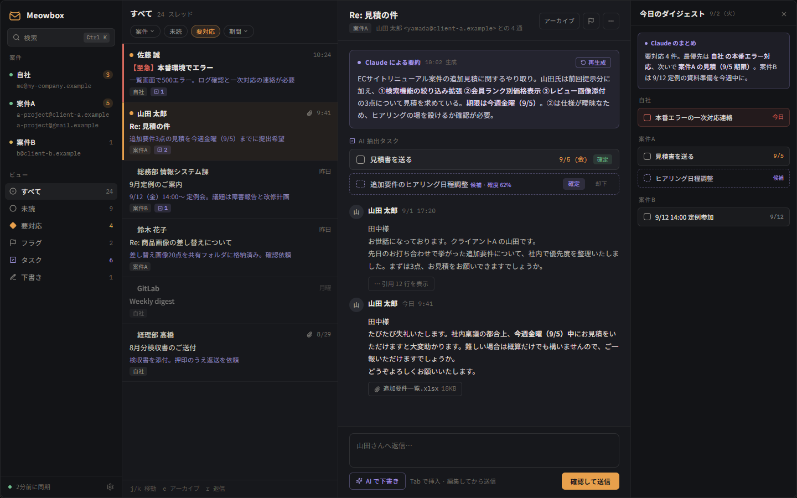

# P2: Tauri v2 デスクトップ UI（モックデータ）

## What

`apps/desktop` を新設し、Claude Design で作ったメイン画面（ダーク）を
Tauri v2 + React 18 + TypeScript + Tailwind v4 で実装した。データはまだモックで、
`src/api/` の関数がそれを返している。

- **シェル** — `AppShell`（sidebar 220 / list 390 固定、thread 伸縮、panel 300 トグル）
- **サイドバー** — 案件（1 案件に複数アドレス）・ビュー・同期状態
- **一覧** — 要対応の左アクセントバー、未読ドット、Claude の 1 行要約、案件タグ、
  抽出タスク数、ホバー時クイックアクション
- **スレッド** — Claude による要約カード、AI 抽出タスク（確定／候補）、
  引用折り畳み、添付チップ、返信欄
- **右パネル** — 今日のダイジェスト（Claude のまとめ + 案件別タスク）
- **キーボード** — `j`/`k` 移動、`e` アーカイブ、`r` 返信、`Ctrl+\` 右パネル、
  `Ctrl+K` コマンドパレット（中身は P5）
- **足回り** — `.editorconfig` / `rustfmt.toml` / `.prettierrc` / `eslint.config.js` /
  `.gitattributes`、GitHub Actions（Rust は ubuntu + windows、フロントは
  lint / format / tsc / vitest / build、Tauri バンドルは windows のみ）
- **ドキュメント** — 公開向け README、ADR 4 本

## Why

- **P3 の差し替えを 1 箇所に閉じるため。** `src/types.ts` は `mailcore` のドメイン型に
  1:1 対応させ、フィールド名と enum を Rust の serde 表現（snake_case）に揃えてある。
  `src/api/` が UI から見た唯一のデータ入口なので、P3 ではその中身を `invoke()` に
  置き換えるだけで済み、コンポーネントには触らない。
- **「誰が書いたか」を見た目で保証するため。** 人間由来は `--accent`、Claude 由来は
  `--ai` に固定し、混ぜない。要約には生成元と生成時刻を必ず添え、確度の低い
  抽出タスクは点線枠の「候補」として実線の確定タスクと形で区別する
  （[ADR 0004](../adr/0004-accent-and-ai-two-colour-rule.md)）。
- **送信を人間の操作に残すため。** MCP には送信ツールを出さない方針
  （[ADR 0002](../adr/0002-no-send-over-mcp.md)）の UI 側の担保として、
  AI の下書きを一度も編集せずに送ろうとしたときだけ確認ダイアログを挟む。
  送信ボタンのラベルは常に「確認して送信」。
- **色の出所を 1 つにするため。** `docs/design/tokens.css` を正とし、Tailwind v4 の
  `@theme inline` でユーティリティに流す。生成 CSS がトークンを直接参照するので、
  `[data-theme]` を差し替えれば実行時に色が入れ替わる
  （[ADR 0003](../adr/0003-design-tokens-as-single-source.md)）。
  ライトテーマは未デザインなので値は入れていない。

## Screenshots

| デザイン | 実装 |
|---|---|
|  |  |

`impl-main-dark.png` は `pnpm tauri dev` で起動した実アプリのクライアント領域を
1440×900 で撮ったもの。デザインと重ねて測った結果:

- 一覧の行区切り: デザイン 77 / 183 / 288 / 393 / 499 / 583 / 688 に対し
  実装 78 / 184 / 289 / 394 / 500 / 584 / 689（**+1px、カード枠の分**）
- 返信欄: デザイン 772 / 785 / 846 / 856 に対し実装 770 / 783 / 844 / 854（**−2px**）
- 3 ペインの境界（220 / 610 / 1140）は一致

残っている差分は下の「既知の差分」を参照。

## 既知の差分（デザインとの意図的なズレ / 未解決）

| 箇所 | 差分 | 理由 |
|---|---|---|
| 検索欄のキー表示 | `⌘K` → `Ctrl K` | Windows 向けなので ⌘ は Ctrl として扱う |
| ビューのアイコン | 記号（◉ ○ ◆ ⚑ ☑ ✎）→ lucide-react | アイコンは lucide に統一する方針。字形がわずかに違う |
| サイドバーの案件A | デザインは選択状態、実装は未選択が初期値 | 起動直後に案件で絞り込まれているのは挙動として不自然なため |
| 本文・要約の行折り返し | 1 文字分ずれる行がある | デザインは Google Fonts 版、実装は `@fontsource` 版の Noto Sans JP。字幅がわずかに違う |
| ライトテーマ | 未実装 | 未デザイン。`[data-theme="light"]` に値を入れれば切り替わる構造だけ用意 |

## フォローアップ（P2 のあとに入れた 5 コミット）

- `chore: add implementer and reviewer subagents` —
  `.claude/agents/` にサブエージェント定義を 2 つ追加し、CLAUDE.md に「作業の割り振り」を書いた。
  以降は計画とレビューをメインが持ち、実装は sonnet 固定の implementer に委譲する。
- `docs: reorder the roadmap to P0-b, P3, P1` —
  実装順を P0-b（IMAP 同期）→ P3（UI を invoke で実データに接続）→ P1（MCP）に変更。
  要約・タスク抽出は MCP 経由を先に入れ、アプリ内で Claude API を叩く方式は後日オプトインで追加する。
- `chore: drop the design reference HTML` —
  `docs/design/main-dark.reference.html` は寸法参照としての役目を終えたので削除した（履歴には残る）。
- `docs(desktop): note the mock date baseline` —
  モックの日付が 2025-09-02 前後で固定されていることを `src/mock/README.md` に残した。
- `docs(desktop): mark CONFIDENT_AT as provisional` —
  確度しきい値 0.8 は暫定。P3 で実際の抽出精度が分かってから `mailcore` に移す。

> サンプルデータから業種が推測できる語を取り除く変更は、追加コミットではなく履歴の書き換えで行った。
> モックを最初に入れたコミットの時点から置換後の文言になっており、実装スクリーンショットも
> 差し替え済み。ブランチはこの PR が初 push のため、公開されるのは書き換え後の履歴だけ。

## Checklist

- [x] `cargo fmt --all -- --check`
- [x] `cargo clippy --workspace --all-targets -- -D warnings`
- [x] `cargo test --workspace`
- [x] `pnpm lint`（eslint。HEX / `rgba()` 直書き禁止ルールを含む）
- [x] `pnpm format:check`（prettier）
- [x] `pnpm tsc --noEmit`
- [x] `pnpm test`（vitest 13 件 / 3 ファイル: TaskRow の確定・候補、
      ReplyBox の未編集 AI 下書きの確認ダイアログ、キーボードナビゲーション）
- [x] `pnpm build`
- [x] `pnpm tauri dev` で起動し、デザインと同じ画面がモックで表示される
- [x] `Cargo.lock` と `pnpm-lock.yaml` をコミットに含めた
- [x] モックデータのアドレスは RFC 2606 の `.example` のみ。実在の社名・人名・
      ドメイン・ローカルパスを含まない
- [x] `.github/workflows/ci.yml` を追加
- [x] ADR 4 本と公開向け README
- [x] `CLAUDE.md` の P2 にチェック、P3 を具体化

## Notes

- Windows でリポジトリのパスに非 ASCII 文字が含まれていると、pnpm のインストールと
  `vite build`（Tailwind のネイティブ部分）が `STATUS_STACK_BUFFER_OVERRUN` で落ちる。
  ASCII パスに置けば再現しない。README に注意書きを入れた
- `src-tauri` は `mailcore` / `mailstore` に path 依存を張ってあるが、まだ呼んでいない。
  依存の向き（core ← store ← sync ← desktop）を先に固定するため
